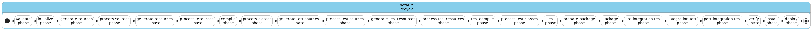
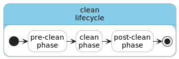
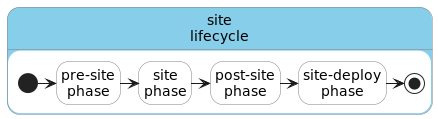
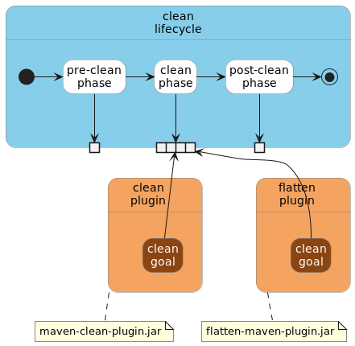
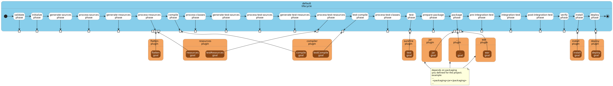

# github-maven-template
Template for maven projects on github

## about
ci/cd template using github actions/workflows for java/maven projects. this template uses a very basic spring app generated via [start.spring.io](http://start.spring.io)

## prerequisites
* java 17
* github account/repo

## design principles
* fail fast
* maven phases map to github jobs in a workflow
* mostly linear, only parallel where it makes sense and is justified
* everything automated until deployment to "live" which is triggered manually
  * always in a releasable state
  * final deployment on demand

## maven considerations
maven was not designed with ci/cd in mind and it also does not do incremental builds by default. 
but maven is flexible enough to execute separate build steps.

usually a developer executes one of these on his machine:
* `mvn package`
* `mvn install`

which is fine for developers builds, but for ci/cd you want to have granular control over the build steps. 

if the build fails for `mvn package` on a developer machine, a developer can investigate the log output. 

for ci/cd it is better to know the error by just looking at the workflow and see which job failed instead of having to inspect logfiles.

this makes it necessary to divide the whole build process up into separate steps. this results in lots of small steps that do particular phase(s) instead of one big build step. 

to understand the ci/cd pipeline design for this template here a refresher on maven:

### lifecycles
in maven there are three lifecycles by default:
* `default`
  * 
* `clean`
  * 
* `site`
  * 

this project will only utilize the `default` lifecycle which revolves all around the development. 
`clean` is for clean while developing and therefore not interesting for this case. 
`site` can be utilized to generate useful documentation but will not be considered in this case.

### phases, plugins and goals
`Phases` themselves do actually nothing. 
they serve as hooks where you can "_plug in_" functionality that needs executing during the **lifecycle's phases executions**. 
this functionality is provided by so-called `Plugins`. 
`Plugins` are essentially jar files that implement so-called `Goals` that contain the actual functionality.

example for `clean` lifecycle:



for our case we concentrate on the phases for the `default` lifecycle: 



this is just an example. your maven project(s) might contain additional/different `Plugins`. 
as you can see in the image above a `Plugin` can provide `Goals` for multiple `Phases`/`Lifecycles`. Examples:
* `resources` plugin provides multiple goals for multiple phases: 
  * `resources` goal --> `process-resources` phase
  * `testResources` goal --> `process-test-resources` phase
* `flatten` even has goals for multiple lifecycles:
  * `clean` lifecycle: `clean` goal --> `clean` phase
  * `default` lifecylce: `flatten` goal --> `process-resources` phase

usually a developer interacts with phases:

`mvn clean`

which would be equivalent in our case with calling those goals directly:

`mvn flatten:clean clean:clean`

### differences of executing phases vs goals

#### phases

maven executes phases linearly by going through all previous phases in the lifecycle. Example:
* what you type:
  * `mvn package`
* what gets executed:
  * `mvn process-resources compile process-test-resources test-compile test package`

#### goals

goals can be executed in isolation, which is what we want in our case. this will effectively enable you to create incremental build steps for our pipeline.

Example: checking for proper code formatting

lets say you have a code format plugin in your project ...

```xml
            <plugin>
                <groupId>com.coveo</groupId>
                <artifactId>fmt-maven-plugin</artifactId>
                <version>${fmt-maven-plugin.version}</version>
            </plugin>
```

...and all you want to do in your first pipeline job is to check if a developer has adhered to code formatting rules in your project. the only command you have to execute in your first pipeline job is:

`mvn fmt:check`

you only call the `check` goal of your formatter plugin. if this fails you can already `fail fast` and avoid wasting any time running jobs for compile, tests, packaging and so on.

### consequences for pipeline design

* each pipeline job will run only these maven goals that are relevant for the job's purpose.
* each pipeline job on github is executed by a different runner/machine
* each pipeline job needs to pass the resulting job build artifacts to the next jobs in the pipeline.
* each pipeline job will assume the previous phases have run in a prior job in the pipeline.

Example on how build artifacts are passed down the pipeline between jobs:
* `compile` job produces `.class` files
* `test` job produces a test report
* `package` job produces `.jar` file(s)
* ...
* `container` job produces a tagged container
* ...

TODO/WIP notes begin

Jobs:
* format-check
* compile
* test (unit tests)
* package
* install / deploy
* containerize
* tests (acceptance tests/performance tests/....)
* deployment to integration environment

TODO/WIP notes end